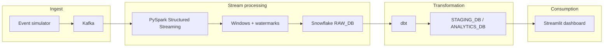

# Real-Time User Behaviour Analytics Platform

End-to-end reference implementation for **streaming user events** through **Kafka**, **PySpark Structured Streaming** (windowed aggregations with watermarks), **Snowflake** as the analytical warehouse, **dbt** for tested staging and mart models, and a **Streamlit** dashboard for KPIs and trends.

**Repository:** [github.com/bhargav-0202/Real-Time-User-Behaviour-Analytics-Platform](https://github.com/bhargav-0202/Real-Time-User-Behaviour-Analytics-Platform)

---

## Architecture



- **Lambda-style split:** streaming path lands raw events in Snowflake; **dbt** builds **staging** views and **mart** tables (including hourly KPIs the dashboard queries).
- **Kafka topics:** `user-clicks`, `user-sessions`, `user-purchases` (configurable via environment variables).

---

## Tech stack

| Layer | Technology |
|--------|------------|
| Messaging | Apache Kafka (+ Zookeeper), [Kafka UI](https://github.com/provectus/kafka-ui) on port 8080 |
| Cache / aux | Redis |
| Stream processing | PySpark 3.5 Structured Streaming, `spark-sql-kafka`, Snowflake Spark connector |
| Warehouse | Snowflake (`RAW_DB` → `STAGING_DB` → `ANALYTICS_DB`) |
| Transform | dbt (staging, intermediate, marts, tests) |
| Visualization | Streamlit + Plotly |
| Container dev | Docker Compose under `docker/` |

---

## Prerequisites

- **Python** 3.11+ (3.13 supported per `requirements.txt` pins)
- **Docker Desktop** (for Kafka, Zookeeper, Redis, Kafka UI)
- **Snowflake account** (optional for the dashboard if you use demo mode)
- **Windows:** PySpark expects a Hadoop home with `winutils` (see [Running PySpark on Windows](#running-pyspark-on-windows))

---

## Quick start

### 1. Clone and environment

```bash
git clone https://github.com/bhargav-0202/Real-Time-User-Behaviour-Analytics-Platform.git
cd Real-Time-User-Behaviour-Analytics-Platform
python -m venv venv
```

**Windows (PowerShell):**

```powershell
.\venv\Scripts\Activate.ps1
pip install -r requirements.txt
```

**macOS / Linux:**

```bash
source venv/bin/activate
pip install -r requirements.txt
```

### 2. Configure secrets

Copy [`.env.example`](.env.example) to **`.env`** in the repo root (this file is **gitignored**).

| Variable | Purpose |
|----------|---------|
| `SNOWFLAKE_ACCOUNT`, `SNOWFLAKE_USER`, `SNOWFLAKE_PASSWORD` | Snowflake auth for **dbt**, **Spark → Snowflake**, and the **Streamlit** app |
| `SNOWFLAKE_WAREHOUSE`, `SNOWFLAKE_DATABASE`, `SNOWFLAKE_SCHEMA` | Optional overrides for the dashboard (defaults: `ANALYTICS_WH`, `ANALYTICS_DB`, `MARTS`) |
| `SNOWFLAKE_DBT_DATABASE`, `SNOWFLAKE_DBT_SCHEMA` | dbt target database/schema (defaults: `STAGING_DB`, `STG`) |

[`dbt/profiles.yml`](dbt/profiles.yml) reads the same variables via `env_var(...)` — **do not commit passwords**; keep them only in `.env` or your CI secrets.

### 3. Start local infrastructure

```bash
cd docker
docker compose up -d
docker compose ps
```

- Kafka: `localhost:9092`
- Redis: `localhost:6379`
- Kafka UI: [http://localhost:8080](http://localhost:8080)

### 4. Snowflake objects

Run the DDL in [`snowflake/setup.sql`](snowflake/setup.sql) (and related scripts as needed) in your Snowflake worksheet so raw, staging, and analytics databases/schemas exist and match what Spark and dbt expect.

### 5. Run the pipeline (typical order)

1. **Event simulator** (Terminal 1) — produces JSON events to Kafka:

   ```bash
   cd simulator
   python kafka_producer.py
   ```

2. **Spark streaming** (Terminal 2) — consumes Kafka, applies watermarks/windows, writes to Snowflake raw tables:

   ```bash
   cd spark_streaming
   python stream_processor.py
   ```

3. **dbt** (Terminal 3) — builds staging and marts:

   ```bash
   cd dbt
   dbt deps   # if you add packages later
   dbt run
   dbt test
   ```

4. **Dashboard** (Terminal 4):

   ```bash
   cd dashboard
   streamlit run app.py
   ```

With valid Snowflake credentials in `.env`, the app queries mart models such as **`AGG_HOURLY_KPIS`**. Without Snowflake, set `DASHBOARD_DEMO=1` in `.env` to use built-in sample data (see `.env.example`).

---

## Running PySpark on Windows

[`spark_streaming/stream_processor.py`](spark_streaming/stream_processor.py) sets `HADOOP_HOME` and may expect WinUtils under `C:\hadoop\bin`. The repo includes [`hadoop_winutils/`](hadoop_winutils/) as a reference; copy `winutils.exe` into your Hadoop layout or adjust paths to match your machine. Checkpoint directories in the script default under `C:/tmp/checkpoints/`.

---

## Project layout

| Path | Role |
|------|------|
| [`docker/`](docker/) | Compose stack for Kafka, Zookeeper, Redis, Kafka UI |
| [`simulator/`](simulator/) | Synthetic click, session, and purchase events → Kafka |
| [`spark_streaming/`](spark_streaming/) | Structured Streaming job → Snowflake raw layer |
| [`dbt/`](dbt/) | dbt project: staging, intermediate, marts, tests |
| [`dashboard/`](dashboard/) | Streamlit analytics UI |
| [`snowflake/`](snowflake/) | Warehouse DDL and Snowpipe-oriented SQL |
| [`airflow/`](airflow/) | Airflow DAG/plugin placeholders for batch orchestration |

---

## Security notes

- Never commit **`.env`** or paste Snowflake passwords into YAML or code.
- If a secret was ever pushed to Git history, **rotate** it in Snowflake and prefer a clean history or secret scanning on the repo.

---

## License

This project is provided as a demonstration / portfolio codebase. Add a `LICENSE` file if you need explicit terms.
